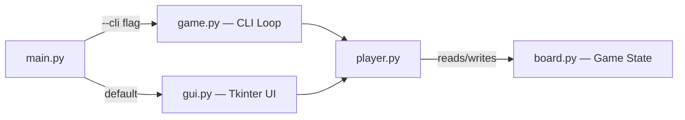
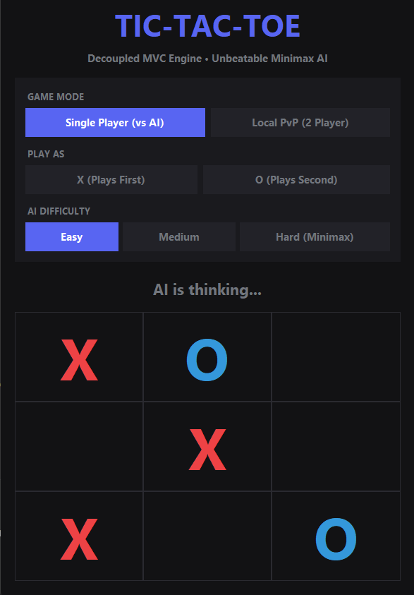
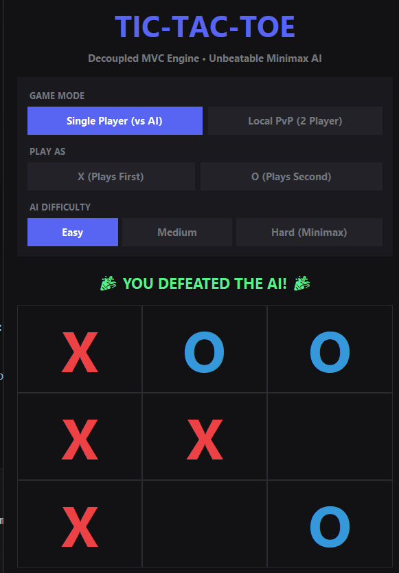
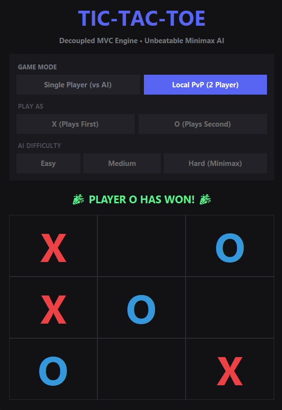
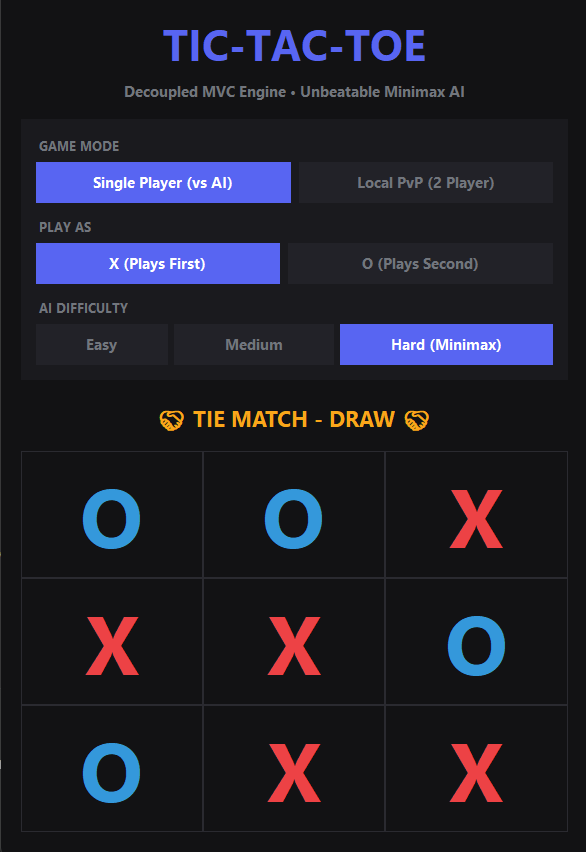

# 🎮 Tic-Tac-Toe — Unbeatable Minimax AI

A desktop and terminal implementation of Tic-Tac-Toe built around a **Minimax-driven AI opponent**, with a clean **Model-View-Controller architecture** that keeps game logic completely decoupled from how it's displayed. The same engine drives both a modern Tkinter GUI and a colorized terminal interface — no duplicated logic between them.

> Built to demonstrate algorithmic problem-solving (recursive game-tree search) and software architecture (separation of concerns), not just a UI exercise.

---

## Why this project is different

Most Tic-Tac-Toe implementations hardcode the AI logic directly into the UI loop. This one doesn't:

- **One game engine, two interfaces.** `board.py`, `player.py`, and `game.py` have zero knowledge of *how* they're being rendered. Swapping the GUI for the CLI (or adding a third interface, like a web frontend) requires no changes to the core logic.
- **A real Minimax implementation**, not a lookup table — the AI recursively searches the entire game tree, scores terminal states with depth-based heuristics (`+10 - depth` / `depth - 10`) to prefer faster wins and slower losses, and is provably unbeatable at Hard difficulty.
- **Three difficulty tiers** built as increasingly sophisticated decision strategies (random → rule-based heuristics → full search), rather than just tuning one algorithm's parameters.

---

## Features

| | |
|---|---|
| 🖥️ **Modern GUI** | Dark-themed Tkinter desktop app with live settings (mode, symbol, difficulty), hover previews, and responsive board sizing |
| ⌨️ **Terminal Mode** | ANSI-colorized CLI fallback with numbered coordinate hints |
| 🤖 **Unbeatable AI** | Full Minimax search — the AI can never lose |
| 🎚️ **3 Difficulty Levels** | Easy (random) · Medium (win/block heuristics) · Hard (Minimax) |
| 👥 **Two Game Modes** | Single Player (vs AI) or local two-player Human vs Human |
| 🔄 **Symbol Choice** | Play as X (first) or O (second) against the AI |

---

## Architecture

```
Tic_Tac_Toe/
│
├── board.py     # MODEL       — grid state, move validation, win/draw detection
├── player.py    # CONTROLLER  — Human input handling + AI decision-making (Minimax)
├── game.py      # VIEW (CLI)  — terminal game loop and colorized rendering
├── gui.py       # VIEW (GUI)  — Tkinter desktop interface and event handling
├── main.py      # ENTRYPOINT  — argument parsing, launches GUI or CLI
│
└── tests/
    └── test_tic_tac_toe.py   # Unit tests for board logic and AI correctness
```

**Design principle:** the `Board` class has no idea whether it's being printed to a terminal or drawn as buttons in a window. `AIPlayer` makes decisions purely from board state — it works identically no matter which interface is calling it. This is what lets `game.py` and `gui.py` exist side by side without duplicating a single line of game rules.



---

## The AI: How Minimax Works Here

At every turn, the AI simulates *every possible game outcome* from the current position:

1. For each available move, place the symbol and recurse into the opponent's best response.
2. Continue recursing until a terminal state is reached (win, loss, or draw).
3. Score terminal states:
   - AI wins → `+10 - depth` (rewards winning **sooner**)
   - Opponent wins → `depth - 10` (delays losing **as long as possible**, in case the human errs)
   - Draw → `0`
4. Propagate scores back up the tree, maximizing on the AI's turn and minimizing on the opponent's — the classic minimax rule.

Because Tic-Tac-Toe's entire state space is small (9! = 362,880 possible orderings), this exhaustive search resolves instantly with no need for alpha-beta pruning — though the same structure could be extended with pruning for a larger game (e.g. Connect Four) with minimal changes.

**Medium difficulty**, by contrast, uses fast rule-based heuristics (check for an immediate win → check for an immediate block → prefer center → else random) rather than search — a useful side-by-side contrast in AI design philosophy within the same codebase.

---

## Getting Started

### Prerequisites
- Python 3.6+
- `tkinter` (included with most standard Python installations)

### Run the GUI (default)
```bash
python main.py
```

### Run the terminal version
```bash
python main.py --cli
```

### Run the tests
```bash
python -m unittest discover -s tests -p "test_*.py"
```

---

## Screenshots

**Desktop GUI** — dark theme, live settings panel, color-coded X/O:

| Single Player — AI thinking | Single Player — Human wins |
|:---:|:---:|
|  |  |

| Local PvP — Player wins | Single Player — Draw (Hard/Minimax) |
|:---:|:---:|
|  |  |

The draw screenshot above (right) is on **Hard (Minimax)** difficulty — a draw is the best any player can force against it, which is exactly the guarantee Minimax is supposed to provide.

**Terminal CLI**:
```
=== STARTING NEW GAME ===

 1 | 2 | 3
---+---+---
 4 | X | 6
---+---+---
 7 | 8 | 9

Player O's turn (AI is thinking...)
```

---

## What I'd Extend Next

- Alpha-beta pruning (to show the optimization even though it's not strictly required at this board size)
- A generalized `N x N` board size, since the current win-condition list is hardcoded for 3x3
- A simple web version (Flask/FastAPI + JS frontend) reusing the same `board.py` / `player.py` core, to prove the decoupling claim across a third interface type

---

## License

MIT
